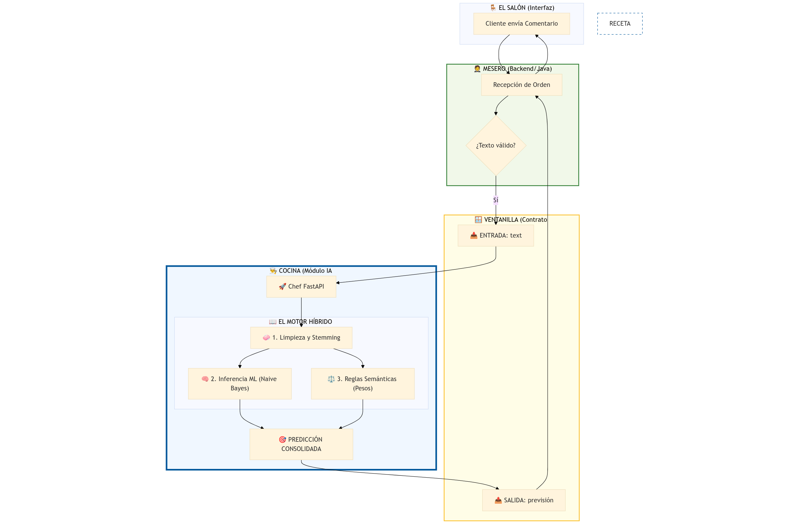

# 🚀 SentimentAPI - Sistema Híbrido G68


## 📝 Descripción
**SentimentAPI** es una plataforma integral para la clasificación de sentimientos en textos. Utiliza un enfoque híbrido que combina modelos de **Machine Learning** con reglas semánticas para determinar si un comentario es **Positivo, Neutro o Negativo**, proporcionando además el nivel de confianza y explicabilidad técnica.

Esta versión del proyecto destaca por su arquitectura de microservicios totalmente integrada y su capacidad de alternar entre modelos locales y remotos (OCI) de forma transparente.

---

## 🏗️ Arquitectura del Sistema (Multi-Model Proxy)

El sistema opera bajo un flujo de tres capas diseñado para maximizar la seguridad (CORS bypass) y la flexibilidad:

<a href="docs/images/infografia_del_proyecto.png" target="_blank">
  
</a>

### Componentes Clave:
- **Frontend (JS/HTML5/CSS Premium):** Interfaz desacoplada que permite la interacción con el usuario y la selección dinámica de modelos.
- **Backend (Java Spring Boot 3.4):** Actúa como **Gateway Orquestador**. Centraliza la lógica de negocio, valida los contratos de datos y funciona como **Proxy Inverso** para evitar restricciones de CORS del navegador al consultar modelos remotos.
- **Microservicio ML (FastAPI):** Servicio especializado en inferencia de baja latencia que procesa el motor híbrido de sentimiento.

---

## 📂 Estructura del Repositorio

```text
.
├── backend-java            # Orquestador (Spring Boot 3.4 / Java 21)
│   ├── api
│   │   ├── pom.xml         # Dependencias (Spring, JPA, H2)
│   │   └── src
│   │       ├── main/java   # Gateway, Lógica de Proxy y Negocio
│   │       └── resources   # Configuración de Red (Port 8000)
├── docs/                   # Documentos técnicos, reportes G68 y contratos
├── frontend/               # Interfaz de Usuario (JS/HTML5/CSS Premium)
│   ├── app.js              # Lógica de consumo de API y manejo de estados
│   └── index.html          # SPA: Análisis de Sentimiento en Tiempo Real
├── ml-python/              # Módulo de Inteligencia Artificial (FastAPI)
│   ├── data                # Repositorio de Modelos y Datasets
│   │   ├── models/         # Modelos binarios serializados (.pkl)
│   │   ├── raw/            # Datasets crudos y léxicos semánticos
│   │   └── processed/      # Datos curados para entrenamiento
│   ├── notebooks/          # Laboratorio (EDA, Modelado y Experimentación)
│   ├── scripts/            # Automatización y pipelines de Datos (Training/Utils)
│   ├── src/                # Motor de inferencia productivo (Port 8080)
│   │   ├── app/            # Lógica Híbrida (IA + Reglas Semánticas)
│   │   └── engine/         # SentimentEngine: Abstracción de modelos ML
│   ├── tests/              # Batería de pruebas de calidad y regresión
│   └── requirements.txt    # Dependencias de producción para ML
├── README.md               # Guía Maestra del Proyecto
├── requirements.txt        # Dependencias raíz para el Gateway
└── requirements-notebooks.txt # Dependencias para el equipo de Data Science
```

### Armonía de Componentes: Una Analogía Sistémica

Para entender cómo opera el ecosistema del proyecto, podemos compararlo con un **Organismo Inteligente** en perfecta sincronía:

1.  **Frontend (Los Sentidos):** Es la ventana al mundo. Capta el estímulo (el texto del usuario) y lo presenta de forma estética, permitiendo al observador elegir qué faceta de la inteligencia desea consultar.
2.  **Backend Java (El Sistema Nervioso):** Es el gran comunicador y protector. Orquesta el flujo de información entre todas las partes, asegurando que los mensajes lleguen íntegros a su destino mientras blinda al sistema contra restricciones externas (Proxy/CORS).
3.  **ML Python (El Intelecto):** Es el núcleo cognitivo. Procesa el estímulo con un enfoque híbrido, interpretando no solo la superficie sino el trasfondo semántico para devolver un juicio con fundamentos técnicos.
4.  **Docs (La Memoria Técnica):** Representa el manual de diseño del organismo. Es el conocimiento compartido que garantiza que cada pieza entienda su función y que el conjunto evolucione de manera coherente.

---

## 🛠️ Guía de Lanzamiento

Este proyecto utiliza **Java 21 (LTS)** y **Python 3.10+**. Para que el sistema funcione correctamente en sus equipos tras bajar la rama, sigan estos pasos:

## 1. Requisitos Previos
*   **JDK 21:** Es obligatorio (Recomendado: Microsoft OpenJDK 21).
*   **Python 3.10+:** Con entorno virtual.

## 2. Configuración del Entorno Python (Local)
Antes de ejecutar los servicios, prepara tu entorno siguiendo estos pasos en la terminal:


**1. Crear entorno virtual (si no existe)**
```bash
python -m venv venv # de preferencia usar el nombre "venv"
```
**2. Activar entorno**
- Windows (PowerShell): 
```bash
.\venv\Scripts\Activate.ps1
```
- Linux/macOS: 
```bash
source venv/bin/activate
```

**3. Actualizar pip y preparar Kernel (Notebooks)**
```bash
pip install --upgrade pip
pip install ipykernel
```

**4. Registrar Kernel para el IDE (VS Code, Antigravity, etc)**
```bash
python -m ipykernel install --user --name venv --display-name "Python (<friendly-name>)"
```

**5. Extensión Recomendada (Opcional)**</br>
Se recomienda instalar la extensión de "Google Colab" en su IDE (preferiblemente la oficial de Google) para una mejor experiencia.

**6. Seleccionar el Kernel en el IDE**</br>
**VITAL:** En la esquina superior derecha de su Notebook (en VS Code) o en la configuración de intérprete de su IDE, seleccione el kernel que registró: "`Python (friendly-name)`". </br>
Esto evita usar el entorno global u otro creado previamente.

**7. Instalar dependencias finales:**</br>
👉 Opción A: Solo para EJECUTAR la API (Nube)
```bash
pip install -r requirements.txt
```

👉 Opción B: Para ENTRENAR o usar Notebooks (Desarrollo)
```bash
pip install -r requirements-notebooks.txt
```

## 3. Configuración de Java (JDK 21)
Si no tienes instalado Java 21 o el comando `./mvnw` falla, sigue estos pasos:

### 1. Verificación Inicial (Universal)
Ejecuta en tu terminal (Bash, PowerShell o CMD):
```bash
java -version
```
*Debe retornar una versión que empiece por "21".*

### 2. Instalación de JDK 21
Si no lo tienes, instálalo según tu sistema operativo:

*   **Linux (Ubuntu/Debian):**
    ```bash
    sudo apt update && sudo apt install openjdk-21-jdk
    ```
*   **Windows / Otros:**
    Descarga el instalador oficial de **Microsoft OpenJDK 21** o **Adoptium Temurin 21**.

### 3. Configuración de Variables de Entorno (VITAL)
**Opción A: Linux (Terminal Bash/Zsh)**
Añade esto a tu `~/.bashrc` (ajusta la ruta si es necesaria):
```bash
export JAVA_HOME=/usr/lib/jvm/java-21-openjdk-amd64
export PATH=$JAVA_HOME/bin:$PATH
```

**Opción B: Windows (PowerShell)**
Ejecuta esto en la terminal antes de lanzar:
```powershell
$env:JAVA_HOME = "C:\Program Files\Microsoft\jdk-21.0.5.11-hotspot"
$env:Path = "$env:JAVA_HOME\bin;" + $env:Path
```

## 4. Comandos de Ejecución
Sigan este orden en terminales separadas:

### Terminal 1: Motor Local de IA (Python)
- **Activa tu entorno virtual(`venv`) ya que es necesario**
- No es necesario activarlo en las demás terminales.

```bash
cd ml-python/src/app
source ../../venv/bin/activate
python -u -m uvicorn main:app --host 0.0.0.0 --port 8080
```

### Terminal 2: Gateway de Integración (Java)
```bash
cd backend-java/api

# En Linux: Dar permisos si es necesario y ejecutar
chmod +x mvnw
./mvnw spring-boot:run

# En Windows:
.\mvnw.cmd spring-boot:run
```

### Terminal 3: Interfaz de Usuario (Web)
```bash
cd frontend
python3 -m http.server 3000
```

Acceso al sistema: **[http://localhost:3000](http://localhost:3000)**

---
*G68 - Calidad y Sentimiento en Tiempo Real* 🚀
